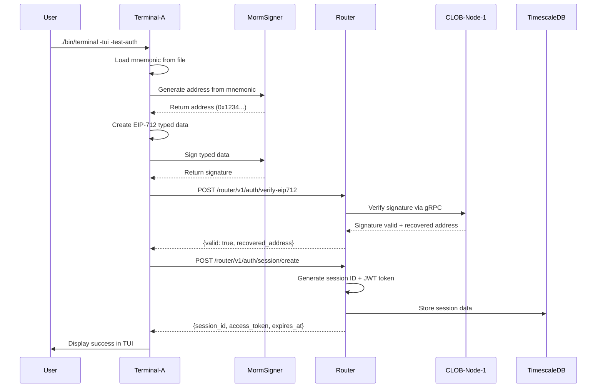

# Demo Step 1: Connect (Sign In)

## Overview
**Objective**: Demonstrate user authentication using existing credentials with EIP-712 signature verification.

**Duration**: ~2 minutes

**Mode**: TUI Mode with authentication test

**Prerequisites**:
- Morpheum CLOB DEX cluster running (mx.yml)
- Router accessible at `http://localhost:8888`
- Terminal-A configured and built
- Test mnemonic available in `scripts/test_mnmeonic.txt`

---

## Architecture Flow



---

## Step-by-Step Execution

### Pre-Step: Verify Infrastructure

**1. Check all services are running:**
```bash
docker-compose -f /home/noderunner/mx.yml ps
```

**Expected Output:**
```
NAME                      STATUS
morpheum-clob-node-1      Up (healthy)
morpheum-clob-node-2      Up (healthy)
morpheum-clob-node-3      Up (healthy)
morpheum-router           Up (healthy)
```

**2. Verify Router health:**
```bash
curl -f http://localhost:8888/health
```

**Expected Output:**
```json
{
  "status": "healthy",
  "timestamp": "2025-10-15T12:34:56Z",
  "version": "0.2.298"
}
```

**3. Verify Node 1 health:**
```bash
curl -f http://localhost:9093/healthz
```

**Expected Output:**
```json
{
  "status": "ok",
  "database": "connected",
  "p2p": "connected"
}
```

---

### Main Step: Execute Connect/Sign In

**Command:**
```bash
cd /home/noderunner/terminal-a
./build/terminal -tui -test-auth
```

**What Happens Internally:**

1. **Mnemonic Loading** (`scripts/test_mnmeonic.txt`)
   - Terminal-A reads the first line of the mnemonic file
   - Validates mnemonic format (12 or 24 words)

2. **Address Generation**
   - Calls `./build/morm_signer` with mnemonic
   - Derives private key using BIP39/BIP44 path
   - Generates Ethereum-compatible address

3. **EIP-712 Typed Data Creation**
   - Creates structured authentication message
   - Includes domain separator, message types, and values
   - Example structure:
   ```json
   {
     "types": {
       "EIP712Domain": [
         {"name": "name", "type": "string"},
         {"name": "version", "type": "string"},
         {"name": "chainId", "type": "uint256"}
       ],
       "Auth": [
         {"name": "address", "type": "address"},
         {"name": "timestamp", "type": "uint256"}
       ]
     },
     "domain": {
       "name": "Morpheum",
       "version": "1",
       "chainId": 1
     },
     "message": {
       "address": "0x1234...",
       "timestamp": 1728987296
     }
   }
   ```

4. **Signature Generation**
   - `morm_signer` signs the typed data with private key
   - Returns 65-byte signature (r, s, v components)

5. **Step 1: Verify EIP712 Signature**
   - POST request to `http://localhost:8888/router/v1/auth/verify-eip712`
   - Payload includes:
     - Signed message
     - Signature (0x... hex)
     - Address (morph1... Bech32 format)
     - EIP712 domain and types
   - Router forwards to CLOB-Node-1 for verification
   - Node verifies signature cryptographically
   - Returns: `{valid: true, recovered_address: "morph1..."}`

6. **Step 2: Create Session**
   - POST request to `http://localhost:8888/router/v1/auth/session/create`
   - Payload includes:
     - Address (from step 1)
     - Signature (proof of ownership)
     - TTL (session duration in seconds)
   - Router generates session ID and JWT token
   - Stores session in database/cache
   - Returns: `{session_id, access_token, expires_at}`

7. **TUI Display**
   - Shows authentication success in Logs Panel
   - Displays session token and expiration
   - Updates User Info Panel with authenticated user

---

## Expected TUI Output

```
┌─────────────────────────────────────────────────────────────────┐
│ Morpheum CLOB DEX - Terminal Application                       │
│ Mode: TUI | Test: Authentication | Time: 12:34:56              │
└─────────────────────────────────────────────────────────────────┘

┌──────────────── User Info Panel ───────────────────────────────┐
│ Users: 1                                                        │
│ Connected: 1                                                    │
│ Authenticated: 1                                                │
│                                                                 │
│ User 1:                                                         │
│   Address: 0x1234567890abcdef1234567890abcdef12345678          │
│   Status: Connected                                             │
│   Token: eyJhbGciOiJIUzI1NiIsInR5cCI6IkpXVCJ9...               │
└─────────────────────────────────────────────────────────────────┘

┌──────────────── Logs Panel ────────────────────────────────────┐
│ [1] 12:34:56 Starting TUI mode with authentication test...     │
│ [1] 12:34:56 Loaded mnemonic from scripts/test_mnmeonic.txt   │
│ [1] 12:34:56 Mnemonic validated: 24 words                      │
│ [1] 12:34:57 Generating address from mnemonic...               │
│ [2] 12:34:57 Address generated: 0x1234567890abcdef...          │
│ [1] 12:34:57 Creating EIP-712 typed data...                    │
│ [2] 12:34:57 Typed data created successfully                   │
│ [1] 12:34:57 Signing authentication message...                 │
│ [2] 12:34:58 Signature generated: 0x789abc...                  │
│ [1] 12:34:58 Step 1: Verifying EIP712 signature...             │
│ [1] 12:34:58 POST /router/v1/auth/verify-eip712                │
│ [2] 12:34:59 Signature verified successfully                   │
│ [2] 12:34:59 Recovered address: morph1abc123...                │
│ [1] 12:34:59 Step 2: Creating session...                       │
│ [1] 12:34:59 POST /router/v1/auth/session/create               │
│ [2] 12:35:00 Session created: sess_123456789abcdef             │
│ [2] 12:35:00 Access token received                             │
│ [2] 12:35:00 Token expiration: 2025-10-16T12:35:00Z            │
│ [2] 12:35:00 ✅ User connected successfully                     │
└─────────────────────────────────────────────────────────────────┘

┌──────────────── Trading Panel ─────────────────────────────────┐
│ Status: Ready                                                   │
│ Balance: Loading...                                             │
└─────────────────────────────────────────────────────────────────┘

Press 'q' to quit | 'r' to refresh | 'h' for help
```

---

## API Specification

### Actual Router API Endpoints

Step 1 uses a **two-step authentication process** via the Router API:

1. **Verify EIP712 Signature**: `/router/v1/auth/verify-eip712`
2. **Create Session**: `/router/v1/auth/session/create`

---

### Step 1a: Verify EIP712 Signature

**Endpoint:**
```
POST http://localhost:8888/router/v1/auth/verify-eip712
```

**Request:**
```http
POST http://localhost:8888/router/v1/auth/verify-eip712
Content-Type: application/json

{
  "message": "Sign this message to authenticate with Morpheum",
  "signature": "0x789abcdef123456789abcdef123456789abcdef123456789abcdef123456789abcdef123456789abcdef123456789abcdef123456789abcdef123456789ab1c",
  "address": "morph1abc123def456ghi789jkl012mno345pqr678st",
  "domain": {
    "name": "Morpheum",
    "version": "1",
    "chainId": "1"
  },
  "types": {
    "EIP712Domain": [
      {"name": "name", "type": "string"},
      {"name": "version", "type": "string"},
      {"name": "chainId", "type": "uint256"}
    ],
    "AuthMessage": [
      {"name": "message", "type": "string"},
      {"name": "timestamp", "type": "uint256"}
    ]
  }
}
```

**Response (Success):**
```http
HTTP/1.1 200 OK
Content-Type: application/json

{
  "valid": true,
  "error_message": "",
  "recovered_address": "morph1abc123def456ghi789jkl012mno345pqr678st"
}
```

**Response (Failure):**
```http
HTTP/1.1 400 Bad Request
Content-Type: application/json

{
  "valid": false,
  "error_message": "Signature verification failed",
  "recovered_address": ""
}
```

---

### Step 1b: Create Session

**Endpoint:**
```
POST http://localhost:8888/router/v1/auth/session/create
```

**Request:**
```http
POST http://localhost:8888/router/v1/auth/session/create
Content-Type: application/json

{
  "address": "morph1abc123def456ghi789jkl012mno345pqr678st",
  "signature": "0x789abcdef...",
  "ttl": 3600
}
```

**Response (Success):**
```http
HTTP/1.1 200 OK
Content-Type: application/json

{
  "session_id": "sess_123456789abcdef",
  "access_token": "eyJhbGciOiJIUzI1NiIsInR5cCI6IkpXVCJ9.eyJhZGRyZXNzIjoibW9ycGgxYWJjMTIzZGVmNDU2Z2hpNzg5amtsMDEybW5vMzQ1cHFyNjc4c3QiLCJleHAiOjE3MjkwNzM2OTZ9.signature",
  "expires_at": 1729073696
}
```

**Response (Failure):**
```http
HTTP/1.1 401 Unauthorized
Content-Type: application/json

{
  "error": "INVALID_SIGNATURE",
  "message": "Failed to create session: invalid signature",
  "code": 401
}
```

---

### Alternative: UserService Login

If user has username/password credentials (not mnemonic-only):

**Endpoint:**
```
POST http://localhost:8888/router/v1/users/login
```

**Request:**
```http
POST http://localhost:8888/router/v1/users/login
Content-Type: application/json

{
  "email": "trader@morpheum.network",
  "username": "trader123",
  "password_hash": "$2a$10$..."
}
```

**Response (Success):**
```http
HTTP/1.1 200 OK
Content-Type: application/json

{
  "user_id": "user_123456789",
  "access_token": "eyJhbGciOiJIUzI1NiIsInR5cCI6IkpXVCJ9...",
  "refresh_token": "eyJhbGciOiJIUzI1NiIsInR5cCI6IkpXVCJ9...",
  "expires_at": 1640995200
}
```

---

### Error Codes

| Error Code | HTTP Status | Description | Resolution |
|------------|-------------|-------------|------------|
| `INVALID_SIGNATURE` | 400 | EIP712 signature verification failed | Check signature format and signer |
| `INVALID_ADDRESS` | 400 | Address format invalid | Use Bech32 "morph1..." format |
| `SESSION_CREATE_FAILED` | 401 | Failed to create session | Verify signature and address |
| `USER_NOT_FOUND` | 404 | User doesn't exist | Run Step 2 (Onboard) first |

---

## Backend Verification

### 1. Check Router Logs
```bash
docker logs morpheum-router --tail 50 | grep -i "auth\|signin"
```

**Expected Log Output:**
```
2025-10-15T12:34:58Z [INFO] Received signin request for address: 0x1234...
2025-10-15T12:34:58Z [INFO] Forwarding signature verification to CLOB-Node-1
2025-10-15T12:34:59Z [INFO] Signature verified successfully
2025-10-15T12:34:59Z [INFO] Generated JWT token for user: 0x1234...
2025-10-15T12:34:59Z [INFO] Signin successful for user: 0x1234...
```

### 2. Check CLOB Node 1 Logs
```bash
docker logs morpheum-clob-node-1 --tail 50 | grep -i "auth\|signature"
```

**Expected Log Output:**
```
2025-10-15T12:34:58Z [INFO] Received signature verification request
2025-10-15T12:34:58Z [INFO] Address: 0x1234567890abcdef...
2025-10-15T12:34:58Z [INFO] Querying user from database
2025-10-15T12:34:59Z [INFO] User found in database
2025-10-15T12:34:59Z [INFO] Verifying EIP-712 signature
2025-10-15T12:34:59Z [INFO] Signature verification: PASSED
```

### 3. Query Database for User
```bash
docker exec morpheum-clob-node-1 psql -U morpheum -d morpheum -c \
  "SELECT address, created_at, last_login FROM users WHERE address = '0x1234567890abcdef1234567890abcdef12345678';"
```

**Expected Output:**
```
                  address                   |       created_at        |        last_login
--------------------------------------------+-------------------------+-------------------------
 0x1234567890abcdef1234567890abcdef12345678 | 2025-10-14 08:30:15+00  | 2025-10-15 12:34:59+00
(1 row)
```

### 4. Verify Token in Session Store
```bash
docker exec morpheum-router redis-cli GET "session:0x1234567890abcdef1234567890abcdef12345678"
```

**Expected Output (if using Redis):**
```
"eyJhbGciOiJIUzI1NiIsInR5cCI6IkpXVCJ9.eyJhZGRyZXNzIjoiMHgxMjM0NTY3ODkwYWJjZGVmMTIzNDU2Nzg5MGFiY2RlZjEyMzQ1Njc4IiwiZXhwIjoxNzI5MDczNjk2fQ.signature"
```

---

## Monitoring & Debugging

### Real-time Log Streaming
Open 3 terminals for real-time monitoring:

**Terminal 1 - Router Logs:**
```bash
docker logs -f morpheum-router | grep --line-buffered -i "auth\|signin\|token"
```

**Terminal 2 - Node 1 Logs:**
```bash
docker logs -f morpheum-clob-node-1 | grep --line-buffered -i "auth\|signature\|verify"
```

**Terminal 3 - Database Activity:**
```bash
docker exec morpheum-clob-node-1 psql -U morpheum -d morpheum -c \
  "SELECT pid, usename, application_name, state, query FROM pg_stat_activity WHERE state = 'active';"
```

### Health Checks During Demo
```bash
# Check all services remain healthy
watch -n 2 'docker-compose -f /home/noderunner/mx.yml ps'

# Monitor resource usage
docker stats morpheum-router morpheum-clob-node-1 --no-stream

# Check network connectivity
curl -w "\nTime: %{time_total}s\n" http://localhost:8888/health
```

---

## Troubleshooting

### Issue 1: "Mnemonic file not found"
**Error:**
```
[4] 12:34:56 ERROR: Failed to load mnemonic: open scripts/test_mnmeonic.txt: no such file or directory
```

**Solution:**
```bash
# Create mnemonic file
cd /home/noderunner/terminal-a
echo "abandon abandon abandon abandon abandon abandon abandon abandon abandon abandon abandon about" > scripts/test_mnmeonic.txt
chmod 600 scripts/test_mnmeonic.txt
```

### Issue 2: "morm_signer binary not found"
**Error:**
```
[4] 12:34:57 ERROR: Failed to generate address: fork/exec ./build/morm_signer: no such file or directory
```

**Solution:**
```bash
# Check if binary exists
ls -lh /home/noderunner/terminal-a/build/morm_signer

# If missing, binary should be in the build directory already
# Verify it's executable
chmod +x /home/noderunner/terminal-a/build/morm_signer
```

### Issue 3: "Router connection refused"
**Error:**
```
[4] 12:34:58 ERROR: Authentication request failed: dial tcp 127.0.0.1:8888: connect: connection refused
```

**Solution:**
```bash
# Check router is running
docker ps | grep router

# Check router port binding
docker port morpheum-router

# Expected output: 8080/tcp -> 0.0.0.0:8888

# Restart router if needed
docker-compose -f /home/noderunner/mx.yml restart router
```

### Issue 4: "Invalid signature"
**Error:**
```
[4] 12:34:59 ERROR: Authentication failed: Invalid signature
```

**Solution:**
```bash
# Verify the mnemonic matches an existing user in the database
docker exec morpheum-clob-node-1 psql -U morpheum -d morpheum -c \
  "SELECT address FROM users LIMIT 5;"

# Use the mnemonic that corresponds to one of these addresses
# Or create a new user first (Step 2: Onboard)
```

### Issue 5: "User not found"
**Error:**
```
[4] 12:34:59 ERROR: Authentication failed: User not found
```

**Solution:**
```bash
# This means the address doesn't exist in the database
# You need to run Step 2 (Onboard) first to create the user

# Or manually insert a test user (for demo purposes only):
docker exec morpheum-clob-node-1 psql -U morpheum -d morpheum -c \
  "INSERT INTO users (address, created_at) VALUES ('0x1234567890abcdef1234567890abcdef12345678', NOW());"
```

---

## Important Notes

### Address Format
The Router API uses **Bech32 address format** (`morph1...`), not Ethereum hex format (`0x...`).

Terminal-A must:
- Generate addresses in the correct format
- Convert between formats if needed
- Use `morph1...` addresses in all API calls

### Two-Step Authentication
Authentication requires **two separate API calls**:
1. Verify EIP712 signature
2. Create session with verified address

This provides better security and session management compared to single-step auth.

---

## Configuration Requirements

### Terminal-A config.yaml
Ensure the following settings in `/home/noderunner/terminal-a/scripts/config.yaml`:

```yaml
# API Configuration
staging_url: "http://localhost:8888"
local_api_base: "http://localhost:8888"
use_external_api: false

# Connection Configuration
use_ssh: false
use_domain: false

# Key Management
mnemonics_file: "./scripts/test_mnmeonic.txt"
morm_signer_bin: "./build/morm_signer"

# Logging
verbose: true
show_logs: true
```

### Router Configuration (mx.yml)
Verify router environment variables:

```yaml
router:
  environment:
    ROUTER_HTTP_PORT: 8080  # Maps to 8888 externally
    JWT_SECRET: "development-jwt-secret-key-change-in-production"
  ports:
    - "8888:8080"  # External:Internal
```

---

## Success Criteria

✅ **Step 1 is successful if:**

1. Terminal-A TUI launches without errors
2. Mnemonic loads from file successfully
3. Address is generated (0x... format)
4. EIP-712 signature is created
5. Router responds with HTTP 200
6. JWT token is returned
7. TUI displays "✅ User connected successfully"
8. User Info Panel shows "Authenticated: 1"
9. No errors in router logs
10. No errors in node logs
11. Database query shows updated `last_login` timestamp

---

## Demo Talking Points

**For Investors:**

1. **Security Focus**:
   - "We use EIP-712 typed signatures, the same standard used by MetaMask and major Web3 applications"
   - "No passwords stored - authentication is cryptographic and secure"

2. **No Validators Required**:
   - "Sign-in is instant - no blockchain validators needed for authentication"
   - "This keeps the user experience fast while maintaining security"

3. **Web3 Native**:
   - "Users authenticate with their wallet mnemonic, just like connecting to any DeFi platform"
   - "Familiar experience for crypto-native users"

4. **Real-time Monitoring**:
   - "The TUI shows every step of the authentication process in real-time"
   - "Full transparency into what's happening under the hood"

5. **Scalability**:
   - "Authentication is handled by the router, which can scale horizontally"
   - "User sessions are managed efficiently with JWT tokens"

---

## Next Steps

After successful completion of Step 1:

1. **User is now authenticated** with a valid JWT token
2. **Ready for Step 2**: Onboard (create a new user)
3. **Token can be used** for subsequent API calls (orders, positions, etc.)
4. **Session is active** until token expiration

**Transition to Step 2:**
- Keep the current TUI session running
- Or restart with: `./build/terminal -tui -test-auth` to demonstrate onboarding

---

## Performance Metrics

**Expected Timings:**
- Mnemonic load: < 10ms
- Address generation: 50-100ms
- Signature creation: 100-150ms
- Router API call: 50-100ms
- Node verification: 50-100ms
- Database query: 10-50ms
- Total duration: **~500ms - 1 second**

**Resource Usage:**
- Terminal-A memory: ~20-30 MB
- Router CPU: < 5%
- Node CPU: < 5%
- Database connections: +1 active

---

## Data Flow Summary

```
User Input (mnemonic)
    ↓
Terminal-A (load & validate)
    ↓
morm_signer (generate address + signature)
    ↓
Router :8888 (receive auth request)
    ↓
CLOB-Node-1 :4000 (verify signature via gRPC)
    ↓
TimescaleDB :5432 (query user)
    ↓
CLOB-Node-1 (verification result)
    ↓
Router (generate JWT)
    ↓
Terminal-A (display success)
    ↓
TUI Panel Update (show authenticated user)
```

---

**Document Version:** 1.0.0
**Last Updated:** October 15, 2025
**Status:** Ready for Demo
**Estimated Duration:** 2 minutes
