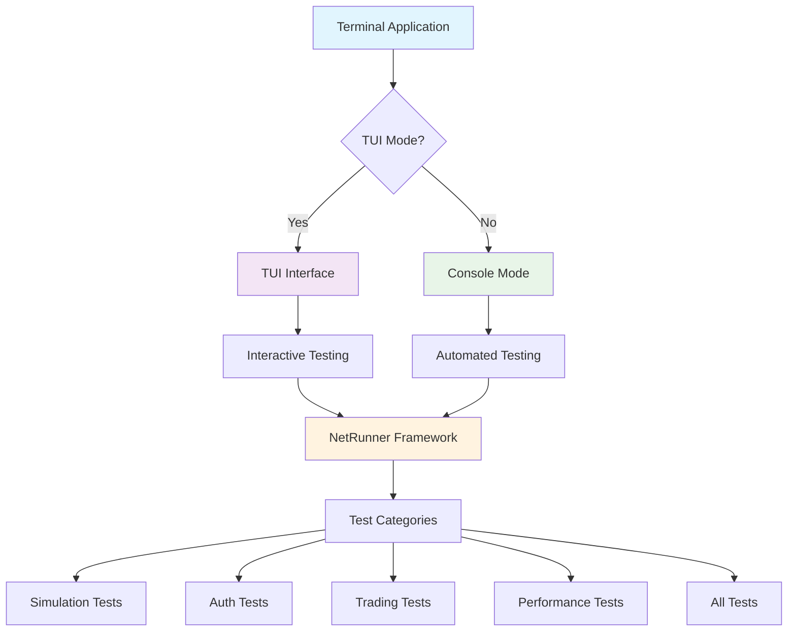

# Terminal Application User Manual

## Table of Contents

1. [Overview](#overview)
2. [Installation & Setup](#installation--setup)
3. [Quick Start Guide](#quick-start-guide)
4. [Usage Modes](#usage-modes)
5. [Command Reference](#command-reference)
6. [Testing Guide](#testing-guide)
7. [Configuration](#configuration)
8. [Troubleshooting](#troubleshooting)
9. [Advanced Usage](#advanced-usage)
10. [FAQ](#faq)

## Overview

The Terminal Application is a comprehensive testing and simulation platform for trading systems. It provides both Terminal User Interface (TUI) and console modes for running various test categories including simulation, authentication, trading, and performance tests.

### Key Features

- **Dual Interface**: TUI mode for interactive testing and console mode for automated testing
- **Comprehensive Testing**: Multiple test categories (simulation, auth, trading, performance, all)
- **Real-time Monitoring**: Live updates and logging during test execution
- **SSH Tunnel Support**: Secure remote server connectivity
- **User Management**: Multi-user simulation capabilities
- **Configuration Management**: Flexible YAML-based configuration

### System Architecture



## Installation & Setup

### Prerequisites

- Go 1.19 or later
- Git
- SSH client (for remote testing)
- Required binaries: `eth_signer`, `morm_signer`

### Quick Installation

```bash
# Clone the repository
git clone <repository-url>
cd terminal

# Install dependencies
go mod tidy

# Build the application
make build-local
```

### Full Setup

1. **Environment Setup**:
   ```bash
   # Ensure Go is installed
   go version
   
   # Set up workspace
   mkdir -p ~/terminal-workspace
   cd ~/terminal-workspace
   ```

2. **Configuration Setup**:
   ```bash
   # Copy and edit configuration
   cp scripts/config.yaml.example scripts/config.yaml
   # Edit configuration as needed
   ```

3. **Required Binaries**:
   ```bash
   # Build required signers
   make build-signers
   
   # Or manually build
   go build -o build/eth_signer cmd/eth_signer/main.go
   go build -o build/morm_signer cmd/morm_signer/main.go
   ```

4. **Test Data Setup**:
   ```bash
   # Ensure mnemonic file exists
   touch scripts/test_mnmeonic.txt
   # Add test mnemonics to the file
   ```

## Quick Start Guide

### 1. Console Mode (Recommended for Beginners)

```bash
# Run simulation tests
bash scripts/run_console.sh simulation

# Run all tests with verbose output
bash scripts/run_console.sh --verbose all

# Run specific test category
bash scripts/run_console.sh trading
```

### 2. TUI Mode (Interactive)

```bash
# Start TUI with 10 users
make run-tui

# Or directly
./bin/terminal -tui -users 10
```

### 3. Direct Binary Usage

```bash
# Build first
make build-local

# Run tests
./bin/terminal -category simulation -verbose
./bin/terminal -category all -timeout 10m
```

## Usage Modes

### Console Mode

Console mode is ideal for automated testing, CI/CD pipelines, and batch operations.

**Features:**
- Command-line interface
- Automated test execution
- Comprehensive logging
- Environment validation
- Configuration management

**Usage:**
```bash
# Basic usage
bash scripts/run_console.sh [OPTIONS] [CATEGORY]

# Examples
bash scripts/run_console.sh simulation
bash scripts/run_console.sh --verbose all
bash scripts/run_console.sh --timeout 10m auth
```

### TUI Mode

TUI mode provides an interactive terminal interface for real-time monitoring and control.

**Features:**
- Real-time updates
- Multiple panels (logs, users, trading)
- Interactive controls
- Live monitoring
- Keyboard navigation

**Usage:**
```bash
# Start TUI
./bin/terminal -tui -users 10 -interval 500ms

# Or use make target
make run-tui
```

## Command Reference

### Console Script Options

| Option | Description | Example |
|--------|-------------|---------|
| `-r, --rebuild` | Force rebuild before running | `--rebuild` |
| `-t, --timeout` | Set test timeout | `--timeout 10m` |
| `-v, --verbose` | Enable verbose logging | `--verbose` |
| `-a, --test-auth` | Test authentication only | `--test-auth` |
| `-h, --help` | Show help message | `--help` |

### Test Categories

| Category | Description | Use Case |
|----------|-------------|----------|
| `simulation` | Multi-user simulation tests | Load testing, user behavior simulation |
| `auth` | Authentication and user creation | Security testing, user management |
| `trading` | Trading system tests | Order matching, position management |
| `performance` | Performance benchmarks | System performance, load testing |
| `all` | All test categories | Comprehensive testing |

### Direct Binary Options

| Flag | Description | Default | Example |
|------|-------------|---------|---------|
| `-category` | Test category to run | `simulation` | `-category auth` |
| `-verbose` | Enable verbose logging | `false` | `-verbose` |
| `-timeout` | Test timeout | `5m` | `-timeout 10m` |
| `-tui` | Enable TUI mode | `false` | `-tui` |
| `-users` | Number of users (TUI mode) | `10` | `-users 20` |
| `-interval` | Update interval (TUI mode) | `500ms` | `-interval 1s` |
| `-test-auth` | Test authentication only | `false` | `-test-auth` |

## Testing Guide

### Running Different Test Types

#### 1. Simulation Tests
```bash
# Console mode
bash scripts/run_console.sh simulation

# Direct binary
./bin/terminal -category simulation -verbose
```

**What it does:**
- Creates 5 users
- Tests user creation and authentication
- Collects bucket information
- Validates system behavior

#### 2. Authentication Tests
```bash
# Console mode
bash scripts/run_console.sh auth

# Direct binary
./bin/terminal -category auth -verbose
```

**What it does:**
- Creates 1 user
- Tests EIP-712 authentication
- Validates signature generation
- Tests token management

#### 3. Trading Tests
```bash
# Console mode
bash scripts/run_console.sh trading

# Direct binary
./bin/terminal -category trading -verbose
```

**What it does:**
- Tests order placement
- Validates order matching
- Tests position management
- Tests risk calculations

#### 4. Performance Tests
```bash
# Console mode
bash scripts/run_console.sh performance

# Direct binary
./bin/terminal -category performance -verbose
```

**What it does:**
- Measures system performance
- Tests under load conditions
- Benchmarks response times
- Memory usage analysis

#### 5. All Tests
```bash
# Console mode
bash scripts/run_console.sh all

# Direct binary
./bin/terminal -category all -verbose
```

**What it does:**
- Runs all test categories sequentially
- Comprehensive system validation
- Aggregates results
- Full system testing

### Test Results Interpretation

#### Success Indicators
- ✅ Green checkmarks indicate successful operations
- Test counts show passed/failed/total
- Duration shows execution time
- No error messages in output

#### Error Indicators
- ❌ Red X marks indicate failures
- Error messages in output
- Non-zero exit codes
- Failed test counts

#### Example Output
```
✅ Tests completed: 6 passed, 0 failed, 6 total
Errors encountered:
  - auth: authentication test failed: failed to create user: failed to generate address: eth_signer failed to generate address: fork/exec /Users/hesdx/Documents/b95/swapbiz/terminal/build/eth_signer: no such file or directory
✅ All tests completed successfully
```

## Configuration

### Configuration File

The main configuration file is `scripts/config.yaml`:

```yaml
# API Configuration
api_base_url: "http://localhost:9855"
max_retries: 3

# SSH Configuration
use_ssh: false
ssh_host: "staging.example.com"
ssh_port: 22
ssh_user: "deploy"

# File Paths
mnemonics_file: "scripts/test_mnmeonic.txt"
morm_signer_bin: "build/morm_signer"
eth_signer_bin: "build/eth_signer"
keys_dir: "scripts/keys"
log_dir: "logs"
reports_dir: "test-results"

# Logging
verbose: false
console_output: true
```

### Environment Variables

The application supports these environment variables:

| Variable | Description | Default |
|----------|-------------|---------|
| `MNEMONICS_FILE` | Path to mnemonic file | `scripts/test_mnmeonic.txt` |
| `KEYS_DIR` | Directory for keys | `scripts/keys` |
| `LOG_DIR` | Directory for logs | `logs` |
| `REPORTS_DIR` | Directory for reports | `test-results` |
| `MORM_SIGNER_BIN` | Path to morm_signer | `build/morm_signer` |

### Logging Configuration

Logs are stored in the `logs/` directory with timestamps:

```
logs/
├── optimized_20250112_120000.log
├── optimized_20250112_120500.log
└── ...
```

Log levels:
- `[1]` - Info
- `[2]` - Success  
- `[3]` - Warning
- `[4]` - Error

## Troubleshooting

### Common Issues

#### 1. Binary Not Found Errors
```
eth_signer failed to generate address: fork/exec /path/to/eth_signer: no such file or directory
```

**Solution:**
```bash
# Build required binaries
make build-signers

# Or manually
go build -o build/eth_signer cmd/eth_signer/main.go
go build -o build/morm_signer cmd/morm_signer/main.go
```

#### 2. Configuration File Not Found
```
Configuration file not found: scripts/config.yaml
```

**Solution:**
```bash
# Create configuration file
cp scripts/config.yaml.example scripts/config.yaml
# Edit as needed
```

#### 3. Mnemonic File Not Found
```
Mnemonic file not found: scripts/test_mnmeonic.txt
```

**Solution:**
```bash
# Create mnemonic file
touch scripts/test_mnmeonic.txt
# Add test mnemonics (one per line)
```

#### 4. API Connection Issues
```
API request failed: HTTP 404: Not Found
```

**Solution:**
- Check if API server is running
- Verify API base URL in configuration
- Check network connectivity

#### 5. SSH Tunnel Issues
```
SSH tunnel failed to establish
```

**Solution:**
- Verify SSH credentials
- Check SSH server accessibility
- Validate SSH configuration

### Debug Mode

Enable verbose logging for debugging:

```bash
# Console mode
bash scripts/run_console.sh --verbose all

# Direct binary
./bin/terminal -category all -verbose
```

### Log Analysis

Check logs for detailed error information:

```bash
# View latest log
tail -f logs/optimized_$(date +%Y%m%d)_*.log

# Search for errors
grep "ERROR" logs/*.log

# Search for specific test
grep "simulation" logs/*.log
```

## Advanced Usage

### Custom Test Scenarios

#### 1. Custom User Count
```bash
# TUI mode with custom user count
./bin/terminal -tui -users 50

# Console mode (modify script)
bash scripts/run_console.sh simulation
```

#### 2. Custom Timeouts
```bash
# Long-running tests
bash scripts/run_console.sh --timeout 30m all

# Quick tests
bash scripts/run_console.sh --timeout 1m simulation
```

#### 3. Authentication-Only Testing
```bash
# Test only authentication
bash scripts/run_console.sh --test-auth

# Or direct binary
./bin/terminal -test-auth
```

### CI/CD Integration

#### GitHub Actions Example
```yaml
name: Terminal Tests
on: [push, pull_request]
jobs:
  test:
    runs-on: ubuntu-latest
    steps:
      - uses: actions/checkout@v2
      - uses: actions/setup-go@v2
        with:
          go-version: '1.19'
      - name: Run Tests
        run: |
          make build-local
          bash scripts/run_console.sh all
```

#### Jenkins Pipeline Example
```groovy
pipeline {
    agent any
    stages {
        stage('Build') {
            steps {
                sh 'make build-local'
            }
        }
        stage('Test') {
            steps {
                sh 'bash scripts/run_console.sh all'
            }
        }
    }
}
```

### Performance Monitoring

#### 1. Resource Usage
```bash
# Monitor during tests
top -p $(pgrep terminal)

# Memory usage
ps aux | grep terminal
```

#### 2. Network Monitoring
```bash
# Monitor API calls
tcpdump -i lo port 9855

# Monitor SSH connections
netstat -an | grep :22
```

## FAQ

### Q: What's the difference between TUI and console mode?

**A:** TUI mode provides an interactive interface with real-time updates and visual panels, while console mode is designed for automated testing and CI/CD pipelines.

### Q: How do I add more test users?

**A:** Add more mnemonics to `scripts/test_mnmeonic.txt` (one per line) or use the `-users` flag in TUI mode.

### Q: Can I run tests against a remote server?

**A:** Yes, configure SSH settings in `scripts/config.yaml` and set `use_ssh: true`.

### Q: How do I interpret test results?

**A:** Look for the summary line: `✅ Tests completed: X passed, Y failed, Z total`. Check the errors section for specific failure details.

### Q: What if tests fail due to missing binaries?

**A:** Build the required binaries using `make build-signers` or manually build `eth_signer` and `morm_signer`.

### Q: How do I customize test timeouts?

**A:** Use the `--timeout` flag in console mode or `-timeout` flag in direct binary usage.

### Q: Can I run specific test categories only?

**A:** Yes, specify the category: `bash scripts/run_console.sh auth` or `./bin/terminal -category trading`.

### Q: How do I enable debug logging?

**A:** Use the `--verbose` flag in console mode or `-verbose` flag in direct binary usage.

### Q: Where are test results stored?

**A:** Results are displayed in the console and logged to files in the `logs/` directory.

### Q: How do I troubleshoot connection issues?

**A:** Check the API base URL in configuration, verify network connectivity, and check logs for detailed error messages.

---

## Support

For additional support and documentation:

- Check the `docs/` directory for detailed technical documentation
- Review logs in the `logs/` directory for error details
- Use the `--help` flag for command-line help
- Check the configuration file for settings

## Version Information

This manual covers Terminal Application v1.0.0

Last updated: January 2025
