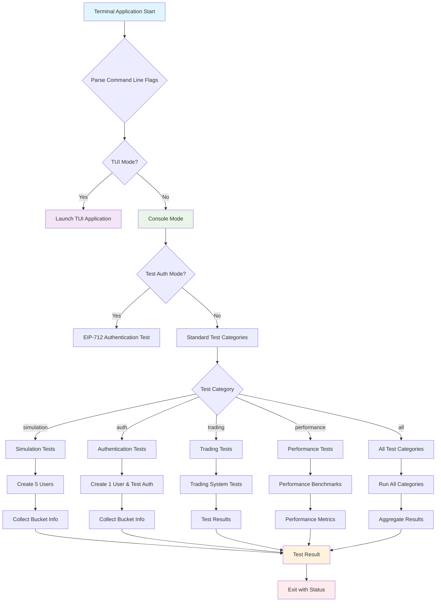
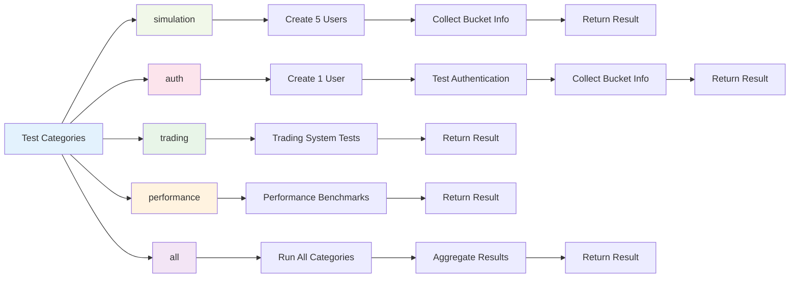
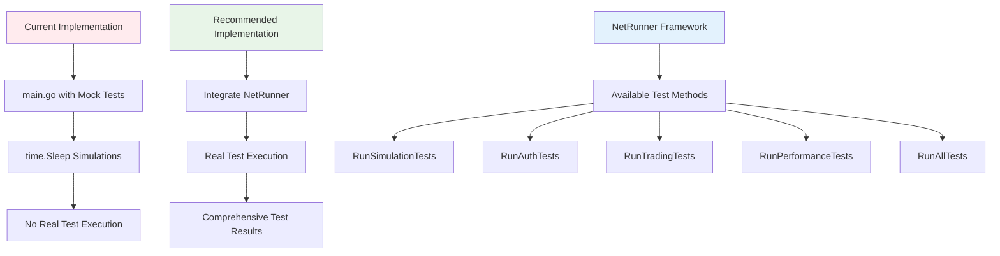
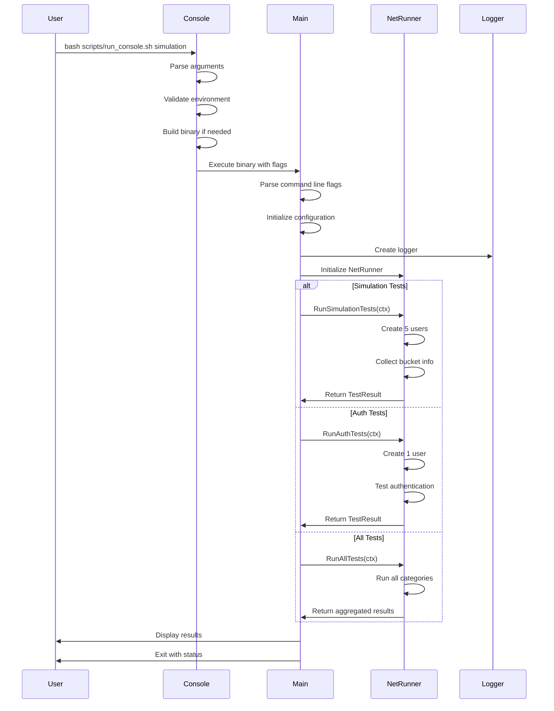

# Non-TUI Mode Test Flow Diagram

## Test Flow Architecture

```mermaid
graph TD
    A[Terminal Application Start] --> B{Parse Command Line Flags}
    B --> C{TUI Mode?}
    C -->|Yes| D[Launch TUI Application]
    C -->|No| E[Console Mode]
    
    E --> F{Test Auth Mode?}
    F -->|Yes| G[EIP-712 Authentication Test]
    F -->|No| H[Standard Test Categories]
    
    H --> I{Test Category}
    I -->|simulation| J[Simulation Tests]
    I -->|auth| K[Authentication Tests]
    I -->|trading| L[Trading Tests]
    I -->|performance| M[Performance Tests]
    I -->|all| N[All Test Categories]
    
    J --> O[Create 5 Users]
    K --> P[Create 1 User & Test Auth]
    L --> Q[Trading System Tests]
    M --> R[Performance Benchmarks]
    N --> S[Run All Categories]
    
    O --> T[Collect Bucket Info]
    P --> U[Collect Bucket Info]
    Q --> V[Test Results]
    R --> W[Performance Metrics]
    S --> X[Aggregate Results]
    
    T --> Y[Test Result]
    U --> Y
    V --> Y
    W --> Y
    X --> Y
    
    Y --> Z[Exit with Status]
    
    style A fill:#e1f5fe
    style D fill:#f3e5f5
    style E fill:#e8f5e8
    style Y fill:#fff3e0
    style Z fill:#ffebee
```

## Test Categories Flow

```mermaid
graph LR
    A[Test Categories] --> B[simulation]
    A --> C[auth]
    A --> D[trading]
    A --> E[performance]
    A --> F[all]
    
    B --> B1[Create 5 Users]
    B1 --> B2[Collect Bucket Info]
    B2 --> B3[Return Result]
    
    C --> C1[Create 1 User]
    C1 --> C2[Test Authentication]
    C2 --> C3[Collect Bucket Info]
    C3 --> C4[Return Result]
    
    D --> D1[Trading System Tests]
    D1 --> D2[Return Result]
    
    E --> E1[Performance Benchmarks]
    E1 --> E2[Return Result]
    
    F --> F1[Run All Categories]
    F1 --> F2[Aggregate Results]
    F2 --> F3[Return Result]
    
    style A fill:#e3f2fd
    style B fill:#f1f8e9
    style C fill:#fce4ec
    style D fill:#e8f5e8
    style E fill:#fff3e0
    style F fill:#f3e5f5
```

## Current vs Recommended Implementation

```mermaid
graph TD
    A[Current Implementation] --> B[main.go with Mock Tests]
    B --> C[time.Sleep Simulations]
    C --> D[No Real Test Execution]
    
    E[Recommended Implementation] --> F[Integrate NetRunner]
    F --> G[Real Test Execution]
    G --> H[Comprehensive Test Results]
    
    I[NetRunner Framework] --> J[Available Test Methods]
    J --> K[RunSimulationTests]
    J --> L[RunAuthTests]
    J --> M[RunTradingTests]
    J --> N[RunPerformanceTests]
    J --> O[RunAllTests]
    
    style A fill:#ffebee
    style E fill:#e8f5e8
    style I fill:#e3f2fd
```

## Test Execution Flow

```mermaid
sequenceDiagram
    participant User
    participant Console
    participant Main
    participant NetRunner
    participant Logger
    
    User->>Console: bash scripts/run_console.sh simulation
    Console->>Console: Parse arguments
    Console->>Console: Validate environment
    Console->>Console: Build binary if needed
    Console->>Main: Execute binary with flags
    
    Main->>Main: Parse command line flags
    Main->>Main: Initialize configuration
    Main->>Logger: Create logger
    Main->>NetRunner: Initialize NetRunner
    
    alt Simulation Tests
        Main->>NetRunner: RunSimulationTests(ctx)
        NetRunner->>NetRunner: Create 5 users
        NetRunner->>NetRunner: Collect bucket info
        NetRunner->>Main: Return TestResult
    else Auth Tests
        Main->>NetRunner: RunAuthTests(ctx)
        NetRunner->>NetRunner: Create 1 user
        NetRunner->>NetRunner: Test authentication
        NetRunner->>Main: Return TestResult
    else All Tests
        Main->>NetRunner: RunAllTests(ctx)
        NetRunner->>NetRunner: Run all categories
        NetRunner->>Main: Return aggregated results
    end
    
    Main->>User: Display results
    Main->>User: Exit with status
```
